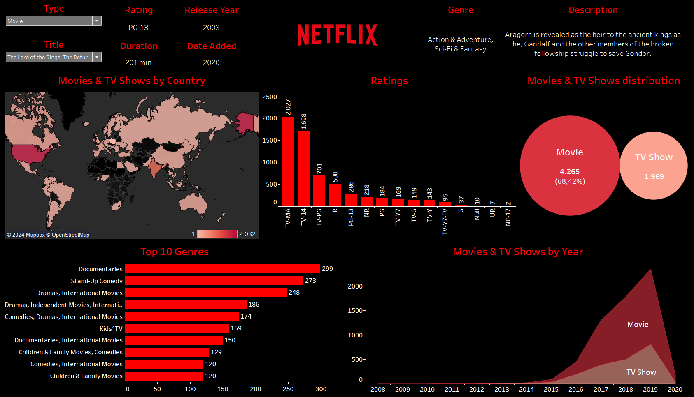

# Netflix Data Analysis Dashboard

This repository contains a Tableau project that provides a comprehensive analysis of Netflix's movie and TV show data. The dashboard offers insights into various aspects such as content distribution, genre popularity, ratings, and release trends.

## Dashboard Overview

The Netflix Data Analysis Dashboard is designed to visualize and explore different dimensions of Netflix's content library, offering a detailed view of content availability, audience preferences, and growth over time.

### Key Metrics

- **Content Type**: Distribution of movies vs. TV shows.
- **Rating**: Distribution of content ratings.
- **Release Year**: Number of titles released each year.
- **Country Distribution**: Geographical distribution of content.
- **Top Genres**: Most popular genres by count.

### Detailed Insights

- **Movies & TV Shows by Country**: A world map showing the distribution of Netflix content across different countries.
- **Ratings Distribution**: A bar chart illustrating the number of titles for each content rating.
- **Top 10 Genres**: A bar chart highlighting the most frequent genres on Netflix.
- **Movies & TV Shows Distribution**: A pie chart comparing the number of movies to TV shows.
- **Movies & TV Shows by Year**: An area chart showing the number of titles released each year.
