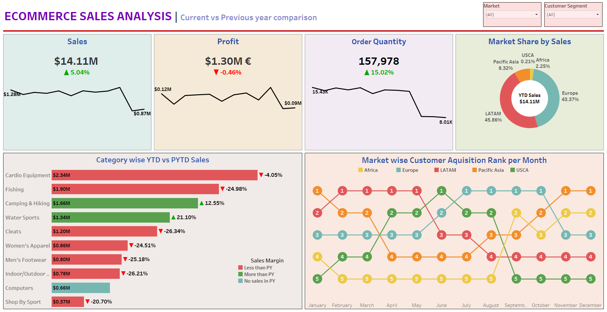
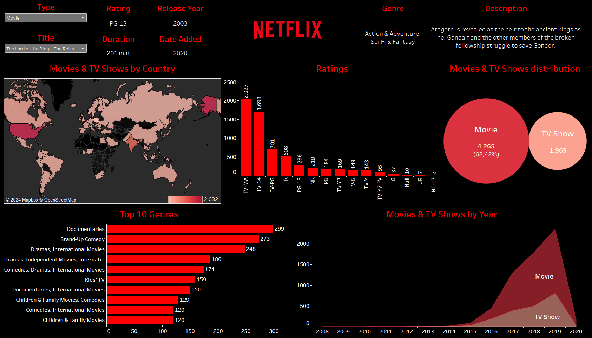

# Tableau Projects

This repository contains various Tableau projects that analyze different datasets to provide valuable insights through interactive dashboards. Each project focuses on a specific domain, presenting key metrics and trends.

## Projects Overview

### 1. [Ecommerce Sales](./Ecommerce-Sales)

This project analyzes ecommerce sales data, providing insights into key performance indicators (KPIs) such as sales, profit, order quantity, and market share by sales.

#### Key Metrics
- **Sales**
- **Profit**
- **Order Quantity**
- **Market Share by Sales**
- **Category-wise YTD vs PYTD Sales**
- **Market-wise Customer Acquisition Rank per Month**

#### Dashboard Preview

### 2. [Netflix Data Analysis](./Netflix-Data-Analysis)

This project provides a comprehensive analysis of Netflix's movie and TV show data, offering insights into content distribution, genre popularity, ratings, and release trends.

#### Dashboard Preview

#### Key Metrics
- **Content Type**
- **Rating**
- **Release Year**
- **Country Distribution**
- **Top Genres**

## Conclusion
Each project in this repository provides valuable insights into different domains through interactive and comprehensive Tableau dashboards. Feel free to explore the data and share your insights!

If you have any questions or need further assistance, please feel free to contact me.
